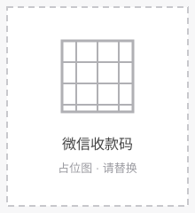
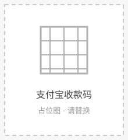

# Nexusnote

>【English】 【[中文](README)】

An Obsidian dashboard plugin for your personal knowledge base — an in-app **Agent Operation Center**. It gives you a one-stop overview and quick-action hub to manage your notes using a four-layer knowledge base structure.

## Features

- **Dashboard overview** — Five stat cards (Vault health, raw materials, knowledge base, tasks, output) give you a single-screen snapshot of your Vault.
- **Note creation trend** — A stock-ticker style line chart with 7-day / 30-day / 6-month / 1-year toggles; hover to see notes created per day.
- **Recent updates** — Lists the most recently modified notes in your Vault; click to jump straight to them.
- **Calendar view** — See note creation by day. Click a date to view that day's notes, or create that day's diary with one click.
- **One-click knowledge base deploy** — On first click, automatically creates the four-layer folder structure and generates the `agent.md` rules file at the Vault root (structure below).
- **Quick create**:
  - New note / Idea — created in the "Ideas" folder from a template.
  - New material — three modes: new from template / import from folder / import from file, copied into the raw-materials layer.
- **Material ingest** — One click opens the Claudian plugin and hands the raw-material layer to it for processing (extract knowledge → knowledge base, inspirations → ideas, deliverables → output; original materials stay untouched).
- **Settings entry** — Jump directly to the plugin settings page from the dashboard.

## Knowledge base structure

The knowledge base uses a four-layer structure (consistent with the `agent.md` rules):

1. `1_原始资料（不可变原料）` — Imported raw materials, kept immutable.
2. `2_创意想法（灵感燃料）` — Ideas and works-in-progress.
3. `3_知识库（AI接管Wiki）` — Structured knowledge.
4. `4_输出（成品出口）` — Final deliverables.

Template files live in the `templater/` folder.

## Development

This project uses TypeScript for type checking and documentation.

- `npm install` — install dependencies
- `npm run dev` — esbuild watch dev mode (watches `src/` and compiles to `main.js`)
- `npm run build` — type check + production build (outputs `main.js`)
- `npm run lint` — ESLint check (includes `eslint-plugin-obsidianmd` rules)

## Installation

Nexusnote supports four installation methods, listed from most to least recommended.

### Method 1: Community plugin marketplace (recommended, pending listing)

1. Obsidian Settings → **Community plugins** → turn off **Restricted mode**.
2. Click **Browse**, search for `Nexusnote`.
3. Click **Install**, then **Enable** when finished.

> This version has not yet been submitted to the official marketplace. Please use Method 2 or 3 below for now.

### Method 2: BRAT (Beta Reviewer's Auto-update Tool)

1. Install and enable **BRAT** from the community plugin marketplace.
2. BRAT Settings → **Add Beta plugin**.
3. Enter the repository: `shuixiande/Nexusnote`.
4. Click **Add Plugin**, then enable Nexusnote when done.
5. To update: BRAT Settings → **Update all beta plugins**.

### Method 3: Manual install (download from GitHub Release)

1. Open Releases: <https://github.com/shuixiande/Nexusnote/releases>
2. Download the latest `main.js`, `manifest.json`, and `styles.css`.
3. Copy them into your Vault's plugin folder (create it if missing):
   `VaultFolder/.obsidian/plugins/Nexusnote/`
4. Settings → **Community plugins** → turn off **Restricted mode** → enable **Nexusnote**.

> `.obsidian` is a hidden directory. On Windows, type the path in the address bar; on macOS press `Cmd+Shift+.` to reveal hidden files.

### Method 4: Build from source (for developers)

```bash
git clone https://github.com/shuixiande/Nexusnote.git
cd Nexusnote
npm install
npm run build
```

The built `main.js` is generated in the root directory. Copy it together with `manifest.json` and `styles.css` into `VaultFolder/.obsidian/plugins/Nexusnote/` (same as steps 3–4 of Method 3).

> This repository tracks `main.js`, so you can fetch it directly. For released versions, use the three files from the GitHub Release to stay in sync with the `manifest.json` version.

### Knowledge base folder structure

On first use, click **One-click knowledge base deploy** on the dashboard — it automatically creates the four-layer folders (consistent with the `agent.md` rules):

| Layer | Folder | Purpose |
|-------|--------|---------|
| 1 | `1_原始资料（不可变原料）` | Imported raw materials, kept immutable |
| 2 | `2_创意想法（灵感燃料）` | Ideas and works-in-progress |
| 3 | `3_知识库（AI接管Wiki）` | Structured knowledge |
| 4 | `4_输出（成品出口）` | Final deliverables |

Template files live in `templater/`.

### First-use suggestions

1. Open the command palette (`Ctrl/Cmd + P`) and run **Nexusnote: Open dashboard**.
2. Click **One-click knowledge base deploy** to generate the four-layer folders and `agent.md`.
3. Use **New note / Idea / Material** to fill in content.
4. Use **Material ingest** to invoke the Claudian plugin for intelligent processing of the raw-material layer.

### FAQ

- **Enabling shows "not in safe mode"?** Settings → Community plugins → turn off **Restricted mode**, then enable again.
- **Dashboard won't open?** Make sure Obsidian ≥ 1.8.0 (the `minAppVersion` in the manifest).
- **No change after updating?** BRAT users run "Update all beta plugins"; manual users re-download and overwrite the three files, then restart Obsidian.
- **Can I delete `agent.md`?** Yes. Clicking **One-click knowledge base deploy** again will regenerate it.

### Uninstall

Settings → Community plugins → Installed → Nexusnote → **Disable / Uninstall**. The plugin does not delete any Vault content; it only removes the dashboard feature and the generated `templater/` and `agent.md`.

## Releasing a new version

1. Update the version number and minimum required Obsidian version in `manifest.json`.
2. Add an entry `"new-version": "minimum-obsidian-version"` in `versions.json`.
3. Create a GitHub Release tagged with the version number, uploading `manifest.json`, `main.js`, and `styles.css`.

## Buy me a coffee ☕

If this plugin helps with your knowledge management, feel free to buy me a coffee ☕ — your support keeps me maintaining it.

| WeChat Pay | Alipay |
|------------|--------|
|  |  |

> The images above are placeholders. Replace them with your real WeChat / Alipay payment QR codes by overwriting `assets/wechat-pay.svg` and `assets/alipay-pay.svg` (or swap in a `.png`/`.jpg` and update the links above).

## API documentation

See https://docs.obsidian.md
